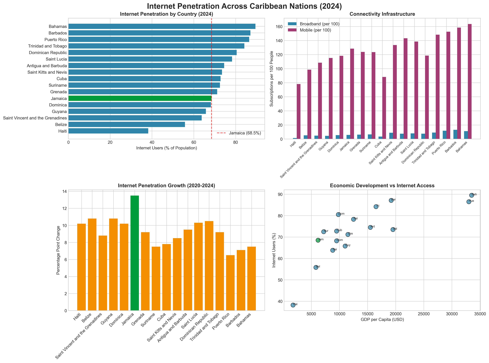
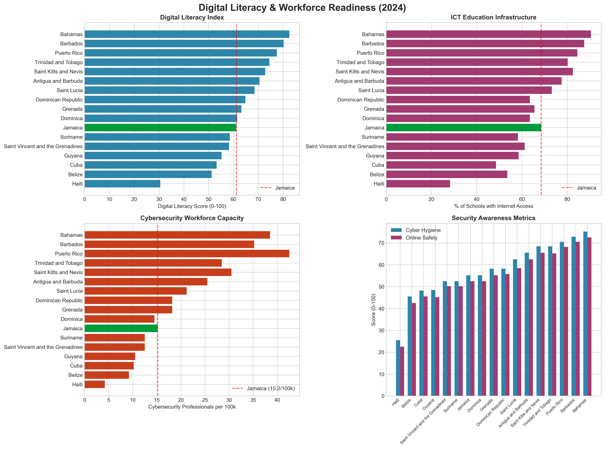
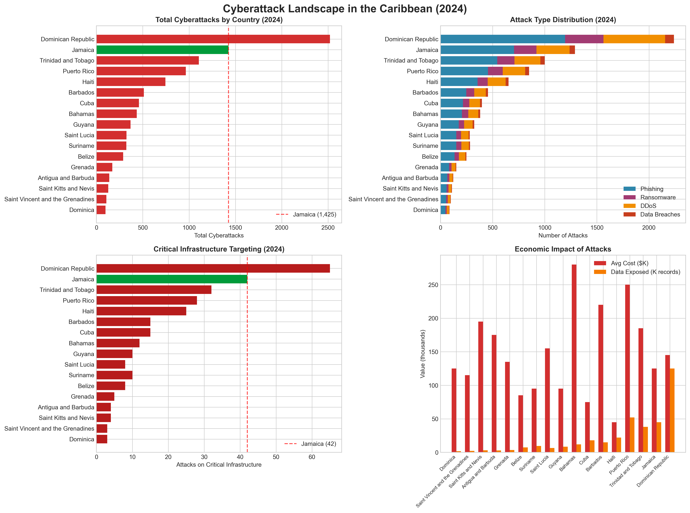
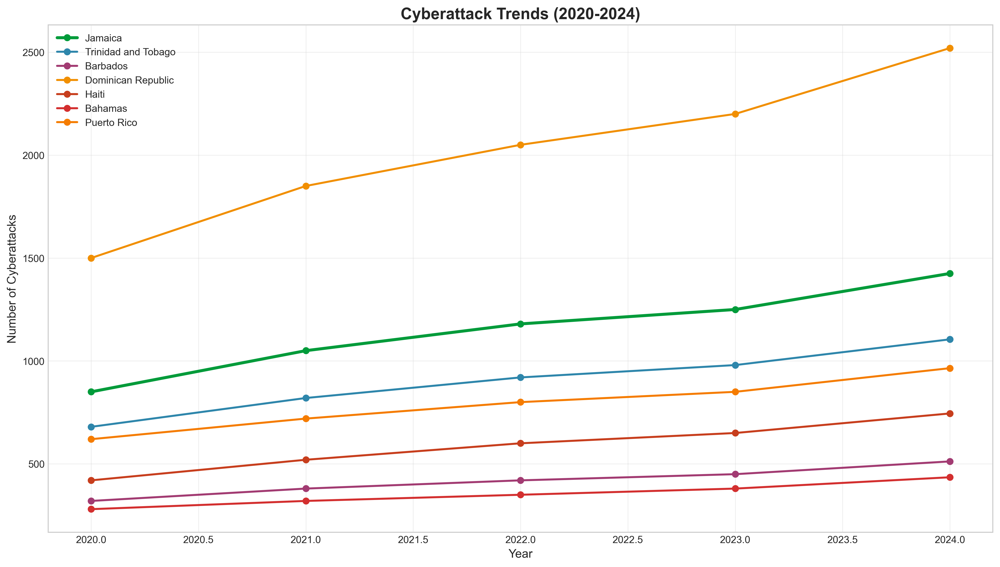
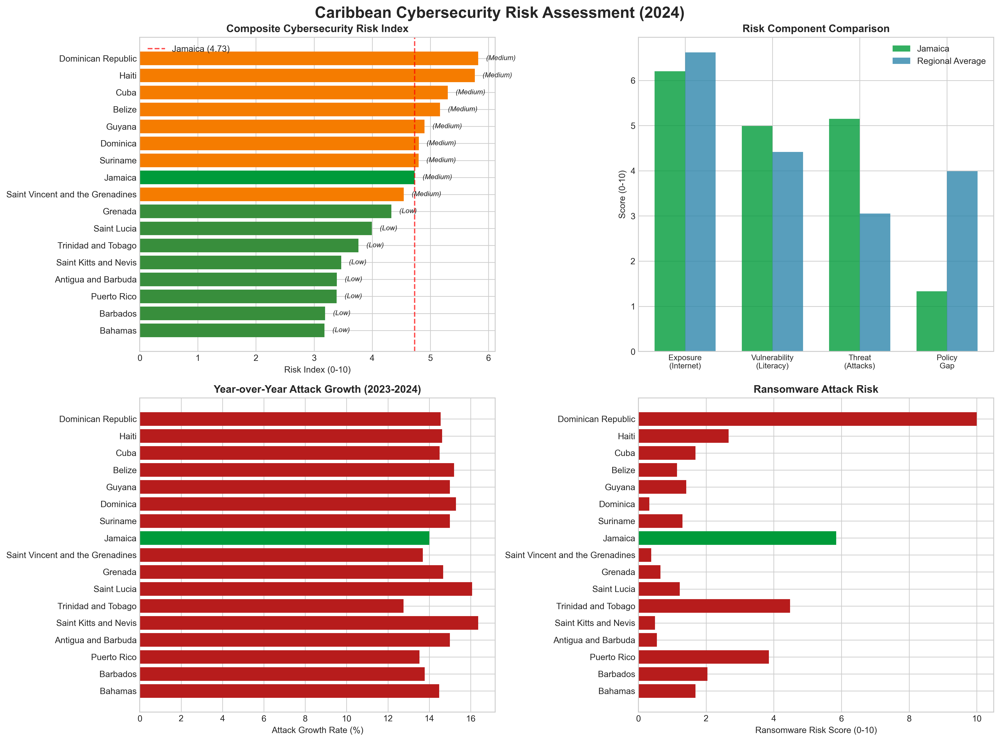
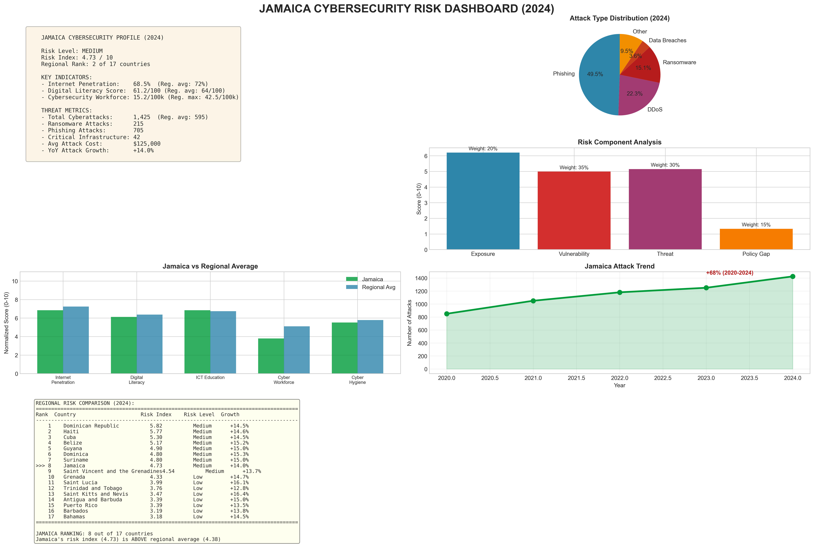

# Caribbean Cybersecurity Risk Assessment

A comprehensive data science and cybersecurity analysis project focused on the Caribbean region, with special emphasis on Jamaica's cybersecurity risk profile.

## Project Overview

This project collects, analyzes, and visualizes public data on cyberattacks, internet penetration, and digital literacy across 17 Caribbean nations. It produces:

- **6 High-Resolution Visualizations** (PNG charts)
- **21-Page Policy Report** (PDF)
- **5 Processed Datasets** (CSV files)
- **Reproducible Python Analysis Pipeline**

## Key Findings (2024 Data)

### Jamaica Risk Assessment
- **Risk Level**: MEDIUM (4.73/10)
- **Regional Rank**: 8 out of 17 Caribbean nations
- **Total Cyberattacks (2024)**: 1,425 (+14.0% YoY)
- **Average Attack Cost**: $125,000
- **Cybersecurity Workforce**: 15.2 professionals per 100k population

### Regional Context
- **Total Caribbean Cyberattacks (2024)**: 10,112 (+14.3% YoY)
- **Internet Penetration Range**: 38.2% (Haiti) to 89.5% (Bahamas)
- **Digital Literacy Range**: 30.5 to 82.5 (0-100 scale)

## Project Structure

```
caribbean-cyber-analysis/
├── data/
│   ├── raw/                    # Raw data (if any)
│   └── processed/              # Processed CSV datasets
│       ├── internet_penetration.csv
│       ├── digital_literacy.csv
│       ├── cyberattacks.csv
│       ├── attack_trends.csv
│       ├── policy_framework.csv
│       └── risk_index.csv
├── scripts/
│   ├── 01_data_collection.py   # Data collection & risk calculation
│   ├── 02_visualizations.py    # Chart generation
│   └── 03_report_generator.py  # PDF report generation
├── visualizations/             # Output PNG charts
│   ├── 01_internet_penetration.png
│   ├── 02_digital_literacy.png
│   ├── 03_cyberattacks.png
│   ├── 04_attack_trends.png
│   ├── 05_risk_assessment.png
│   └── 06_jamaica_dashboard.png
├── report/                     # Output PDF report
│   └── Caribbean_Cybersecurity_Risk_Assessment_Jamaica.pdf
├── requirements.txt            # Python dependencies
├── run_analysis.py            # Master script to run all steps
└── README.md                  # This file
```

## Installation

### Prerequisites
- Python 3.8 or higher
- pip (Python package manager)

### Install Dependencies

```bash
cd caribbean-cyber-analysis
pip install -r requirements.txt
```

**Required packages:**
- pandas >= 1.5.0
- numpy >= 1.23.0
- requests >= 2.28.0
- beautifulsoup4 >= 4.11.0
- matplotlib >= 3.6.0
- seaborn >= 0.12.0
- fpdf2 >= 2.7.0
- lxml >= 4.9.0

## Usage

### Run Complete Analysis Pipeline

```bash
# Option 1: Run the master script (recommended)
python run_analysis.py

# Option 2: Run scripts individually
python scripts/01_data_collection.py    # Collect data & calculate risk
python scripts/02_visualizations.py     # Generate charts
python scripts/03_report_generator.py   # Create PDF report
```

### Expected Output

After running the complete pipeline, you should see:

```
======================================================================
  CARIBBEAN CYBERSECURITY DATA COLLECTION (2024 Update)
======================================================================
Fetching World Bank indicators...
  Retrieved 5 indicator categories from World Bank API
Compiling Caribbean cybersecurity dataset (2024 update)...

Data saved to: [path]/data/processed

  Countries analyzed: 17
  Total Cyberattacks (2024): 10,112
  YoY Growth: 14.3%

  RISK INDEX RANKINGS:
  --------------------------------------------------
    Dominican Republic           5.82  Medium     (+14.5%)
    Haiti                        5.77  Medium     (+14.6%)
    ...
    Jamaica                      4.73  Medium     (+14.0%) >>>
    ...

======================================================================
  GENERATING VISUALIZATIONS
======================================================================
  Created: 01_internet_penetration.png
  Created: 02_digital_literacy.png
  Created: 03_cyberattacks.png
  Created: 04_attack_trends.png
  Created: 05_risk_assessment.png
  Created: 06_jamaica_dashboard.png

======================================================================
Generating Policy Report
======================================================================
Policy report generated: [path]/report/Caribbean_Cybersecurity_Risk_Assessment_Jamaica.pdf
Total pages: 21
```

## Data Sources

The project compiles data from multiple authoritative sources:

1. **World Bank API** - Internet penetration, GDP, broadband data
2. **International Telecommunication Union (ITU)** - Digital development indicators
3. **UNCTAD B2C E-commerce Index** - Digital economy metrics
4. **ENISA Threat Landscape** - European threat data for comparison
5. **Regional CERT Reports** - Caribbean-specific incident data
6. **IMF Country Data** - Economic indicators

## Methodology

### Risk Index Calculation

The cybersecurity risk index is calculated using a weighted composite methodology:

```
Risk Index = (Exposure × 0.20) + (Vulnerability × 0.35) + (Threat × 0.30) + (Policy Gap × 0.15)
```

#### Components:

1. **Exposure (20% weight)**
   - Internet penetration rate
   - Digital government index
   - Higher scores = larger attack surface

2. **Vulnerability (35% weight)**
   - Digital literacy score (inverse)
   - Cybersecurity workforce per capita (inverse)
   - Cyber hygiene score (inverse)

3. **Threat (30% weight)**
   - Attack frequency
   - Attack growth rate
   - Ransomware severity

4. **Policy Gap (15% weight)**
   - National cybersecurity strategy
   - Data protection laws
   - CERT team existence
   - Cybercrime law strength

### Risk Level Classification

- **Critical**: Risk Index ≥ 7.5
- **High**: Risk Index 6.0 - 7.49
- **Medium**: Risk Index 4.5 - 5.99
- **Low**: Risk Index < 4.5

## Customization

### Modifying Report Content

Edit `scripts/03_report_generator.py`:

```python
# Change executive summary
executive_summary = f"""Your custom text with {jamaica_risk['risk_index']:.2f}..."""

# Add new sections
pdf.add_page()
pdf.chapter_title('New Section')
pdf.body_text('Your content here...')

# Add charts
pdf.add_chart('path/to/chart.png', 'Caption')
```

### Updating Data

Edit `scripts/01_data_collection.py` to modify the datasets:

```python
# Update internet data
internet_data = {
    'country': [...],
    'internet_users_pct_2024': [...],
    # Add/update data here
}
```

## Visualizations

The project generates 6 professional charts:

### Sample Visualizations


*Figure 1: Internet penetration and connectivity infrastructure across Caribbean nations*


*Figure 2: Digital literacy and workforce capacity indicators*


*Figure 3: Cyberattack statistics by type and target sector*


*Figure 4: Historical cyberattack trends (2020-2024)*


*Figure 5: Composite cybersecurity risk index*


*Figure 6: Jamaica cybersecurity risk dashboard*

---

## Report Sample


*The 21-page PDF policy report includes comprehensive analysis and recommendations*

---

## Report Structure

The 21-page PDF report includes:

1. **Title Page**
2. **Executive Summary** - Key findings and risk assessment
3. **Table of Contents**
4. **Introduction and Methodology**
5. **Regional Cybersecurity Landscape**
6. **Internet Penetration Analysis**
7. **Digital Literacy Assessment**
8. **Jamaica Risk Profile**
9. **Policy Recommendations**
   - Immediate Actions (0-6 months)
   - Medium-Term Initiatives (6-18 months)
   - Long-Term Strategic Goals (18+ months)
10. **Regional Cooperation Opportunities**
11. **Conclusion**
12. **Appendices** - Data tables and methodology

## Troubleshooting

### Common Issues

1. **"Module not found" errors**
   ```bash
   pip install -r requirements.txt --upgrade
   ```

2. **PDF generation fails**
   - Ensure all visualization PNG files exist in the `visualizations/` folder
   - Check that CSV files exist in `data/processed/`

3. **Charts not generating**
   - Ensure matplotlib backend is configured correctly
   - Try: `matplotlib.use('Agg')` before importing pyplot

4. **World Bank API timeout**
   - The script will use fallback compiled data if API fails
   - Check internet connection

## License

This project is for educational and research purposes. Data sources maintain their original licenses.

## Citation

If you use this project in your research, please cite:

```
Caribbean Cybersecurity Risk Assessment (2026). 
Data Science & Cybersecurity Analysis Project.
York Castle High School
```

## Contact & Support

For questions or issues:
1. Check the code comments in each script
2. Review the methodology section in the PDF report
3. Examine the data dictionaries in the CSV files

---

**Last Updated**: March 31, 2026  
**Data Year**: 2024 (with historical trends 2020-2024)  
**Countries Analyzed**: 17 Caribbean nations